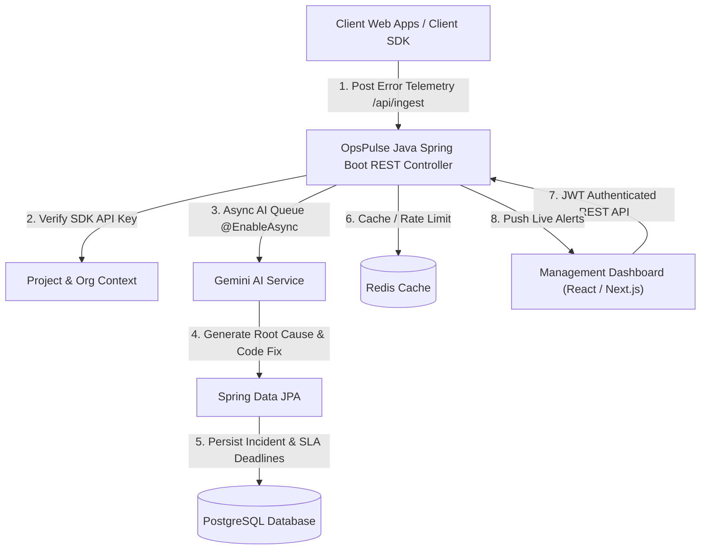

# 🚀 OpsPulse — Enterprise AI-Driven Incident Management & SRE Platform (Java Edition)

[](https://jdk.java.net/)
[](https://spring.io/projects/spring-boot)
[](https://spring.io/projects/spring-security)
[](https://www.postgresql.org/)
[](https://redis.io/)
[](https://ai.google.dev/)
[](https://www.docker.com/)

**OpsPulse** is a production-ready, enterprise-grade Incident Management System and AI-powered Site Reliability Engineering (SRE) engine. Built with **Java 21** and **Spring Boot 3**, it ingests real-time application error telemetry, automatically diagnoses root causes using **Google Gemini AI**, calculates SLA breach deadlines, enforces multi-tenant Role-Based Access Control (RBAC), and manages the complete lifecycle of software incidents.

---

## 🏗️ Architecture & System Design



---

## 🌟 Key Features

- 🤖 **AI Root-Cause & Code Fix Generation**: Automatically sends captured stack traces and user breadcrumbs to Google Gemini 2.0 Flash to diagnose root causes and suggest code snippets for resolution.
- 🏢 **Multi-Tenant Role-Based Access Control (RBAC)**: Fine-grained security roles (`ADMIN`, `MANAGER`, `DEVELOPER`) powered by Spring Security 6 & stateless JWT authentication.
- ⏱️ **Automated SLA Engine**: Dynamically calculates Response and Resolution SLA deadlines based on Organization Subscription Tiers (`BASIC`, `ADVANCED`, `PRO`, `ENTERPRISE`) and Incident Severity (`CRITICAL`, `HIGH`, `MEDIUM`, `LOW`).
- ⚡ **High-Concurrency Telemetry Ingestion**: Non-blocking ingestion pipeline capable of accepting thousands of client SDK error logs per second with Redis rate-limiting and asynchronous background processing (`ThreadPoolTaskExecutor`).
- 🔗 **GitHub Webhooks**: Automatically generates incidents when GitHub CI/CD pipelines fail or PR merge conflicts occur.
- 🔔 **Incident Lifecycle & Activity Audit**: Full tracking of status updates (`OPEN`, `ASSIGNED`, `IN_PROGRESS`, `RESOLVED`), team assignments, user comments, and audit activities.
- 📄 **Interactive OpenAPI / Swagger UI Documentation**: Fully documented REST API endpoints accessible out-of-the-box.
- ⚙️ **Automatic Data Seeding**: Seeds demo organization, projects, user accounts, and test incidents on initial boot (`DataInitializer`).

---

## 🛠️ Tech Stack & Design Patterns

### Backend Framework & Core Libraries
* **Language & Runtime**: Java 21 (LTS) / JDK 23 compatible
* **Framework**: Spring Boot 3.3.4 (Spring Web MVC, Spring Data JPA, Spring Security 6)
* **Authentication**: Stateless JSON Web Tokens (JJWT 0.12.6)
* **AI Engine**: Google Gemini REST API (`gemini-2.0-flash`)
* **Persistence**: PostgreSQL 16 & H2 (In-memory fallback)
* **Caching & Rate Limiting**: Spring Data Redis
* **API Documentation**: Springdoc OpenAPI / Swagger UI 2.6.0
* **Build System**: Apache Maven 3.9+
* **Containerization**: Docker & Multi-stage `docker-compose`

### Software Architecture & Design Patterns
* **Repository Pattern**: Clean data abstraction using Spring Data JPA Repositories.
* **DTO Pattern**: Decoupled domain models from client API request/response contracts (`ApiResponse<T>`, `AuthDtos`, `IssueDtos`, `ProjectDtos`).
* **Strategy Pattern**: Flexible SLA calculations tailored per organization subscription plan.
* **Global Exception Handling**: Centralized REST error handling via `@RestControllerAdvice`.
* **Async Event Processing**: Background execution using Spring `@EnableAsync` thread pool executors.

---

## 📁 Repository Structure

```
OpsPulse-monorepo/
├── devnexus-backend-java/        # 🚀 Java 21 Spring Boot 3 Enterprise Service
│   ├── src/main/java/com/opspulse/
│   │   ├── config/              # Security, Redis, Async, CORS & Swagger Configs
│   │   ├── controller/          # REST API Controllers (Auth, Issues, Projects, Ingest, Webhooks)
│   │   ├── dto/                 # Request/Response Data Transfer Objects
│   │   ├── entity/              # JPA Entities (User, Project, Issue, Team, Org, etc.)
│   │   ├── exception/           # Custom Exceptions & Global Exception Handler
│   │   ├── repository/         # Spring Data JPA Repositories
│   │   ├── security/           # JWT Token Provider & Auth Filters
│   │   ├── service/            # Core Business Services (AI, SLA, Auth, Ingest)
│   │   └── util/               # DataInitializer (Database Seeder)
│   ├── pom.xml                  # Maven Project Dependencies
│   └── Dockerfile               # Multi-Stage Production Build
├── incident-management-system/  # 💻 Next.js Front-End & Dashboard
├── sdk/                         # 📦 Client Error Tracking SDK (TypeScript)
├── docker-compose.yml           # 🐳 Full Stack Docker Deployment
└── README.md
```

---

## 🚦 Getting Started

### Prerequisites
* **Java**: JDK 21 or higher (`java -version`)
* **Maven**: Apache Maven 3.8+ (`mvn -version`)
* **Docker & Docker Compose** (Optional for containerized run)

### Running Locally with Maven

1. **Clone the repository & enter Java service directory**:
   ```bash
   cd devnexus-backend-java
   ```

2. **Compile and build the project**:
   ```bash
   mvn clean compile
   ```

3. **Start the OpsPulse Java Engine**:
   ```bash
   mvn spring-boot:run
   ```

4. **Access the API & Swagger Documentation**:
   * **Swagger UI**: [http://localhost:8080/swagger-ui.html](http://localhost:8080/swagger-ui.html)
   * **Health Check**: [http://localhost:8080/api/health](http://localhost:8080/api/health)

---

## 🔑 Pre-Configured Demo Credentials

On first run, the system automatically initializes seed data:

| Role | Email | Password | Access Rights |
| :--- | :--- | :--- | :--- |
| **Admin** | `admin@opspulse.io` | `Password123!` | Full System Administration, Project Creation, User Mgmt |
| **Manager** | `manager@opspulse.io` | `Password123!` | Project Management, Incident Assignment, SLA Oversight |
| **Developer** | `dev@opspulse.io` | `Password123!` | Incident Resolution, Commenting, Status Updates |

* **Demo Project API Key**: `sdk_demo_key_12345`

---

## 📡 Core REST API Endpoints

### 🔑 Auth API
* `POST /api/auth/register` — Register a new account & organization
* `POST /api/auth/login` — Authenticate and receive a JWT Bearer Token
* `GET /api/auth/me` — Retrieve current authenticated user details

### 🐞 Incident & SLA API
* `POST /api/issues` — Create an incident manually
* `GET /api/issues/{id}` — Get detailed incident view, activities, & comments
* `PUT /api/issues/{id}` — Update status, team assignment, or root cause
* `GET /api/issues/project/{projectId}` — Get paginated incidents for a project
* `POST /api/issues/{id}/comments` — Add a developer discussion comment

### 📥 Telemetry Ingestion API (SDK)
* `POST /api/ingest` — Ingest client stack trace telemetry and trigger AI root cause analysis

### 🔗 GitHub Webhook API
* `POST /api/webhooks/github` — Receive GitHub workflow failure & PR events

---

## 🐳 Running with Docker Compose

To launch the complete infrastructure (PostgreSQL, Redis, Java Spring Boot Backend):

```bash
docker compose up -d --build
```

---

## 📝 Resume Summary Points

> **OpsPulse — Enterprise AI Incident & SRE Management Platform**
> * Designed and built a high-throughput Java 21 & Spring Boot 3 incident management service capable of ingesting error telemetry, diagnosing root causes via Google Gemini AI, and managing real-time SRE workflows.
> * Implemented stateless JWT security and Multi-Tenant RBAC (`ADMIN`, `MANAGER`, `DEVELOPER`) using Spring Security 6.
> * Developed an automated SLA calculation engine with strategy-pattern response/resolution deadlines based on subscription tiers and incident severity.
> * Utilized Spring Data JPA, PostgreSQL, Redis rate-limiting, and async thread pools (`ThreadPoolTaskExecutor`) for resilient, high-concurrency event handling.
> * Documented 100% of REST APIs with Swagger/OpenAPI and containerized deployment with multi-stage Docker Compose builds.

---

<div align="center">
  <p>Built with ❤️ using <strong>Java 21 & Spring Boot 3</strong> | © 2026 OpsPulse Engineering</p>
</div>
